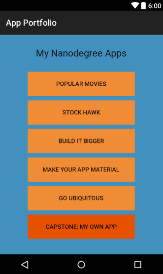

# Erik's Udacity Portfolio

This is an Android app that links to all of the Android apps I've built in the Udacity Nanodegree program.

## Project Goals

* Build an app layout that showcases the apps you will build across your Nanodegree journey.
* Introduce you to the process of submitting a project for review. You will be expected to submit projects for review throughout the program, so it's important that you go through the process early.
* Familiarize you with the experience of receiving feedback on your work from Udacity reviewers.

## Required Components

* [x] Download Android Studio
* [x] Create a new project in Android Studio using the "Application with blank activity" template
* [x] Create a layout for your main activity, adding a title, buttons for each app, and a style of your choosing

